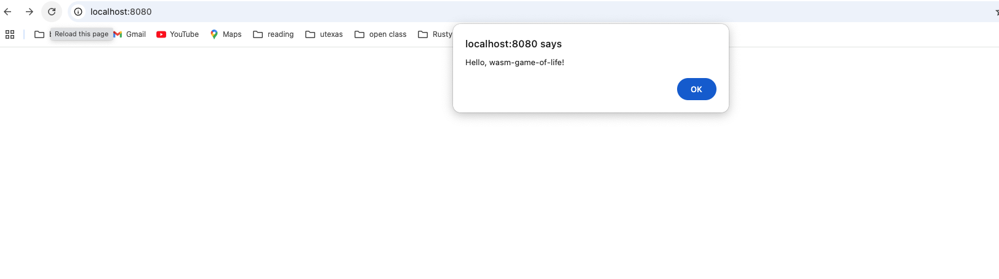

<div align="center">

  <h1><code>wasm-pack-template</code></h1>

  <strong>A template for kick starting a Rust and WebAssembly project using <a href="https://github.com/rustwasm/wasm-pack">wasm-pack</a>.</strong>

  <p>
    <a href="https://travis-ci.org/rustwasm/wasm-pack-template"></a>
  </p>

  <h3>
    <a href="https://rustwasm.github.io/docs/wasm-pack/tutorials/npm-browser-packages/index.html">Tutorial</a>
    <span> | </span>
    <a href="https://discordapp.com/channels/442252698964721669/443151097398296587">Chat</a>
  </h3>

  <sub>Built with 🦀🕸 by <a href="https://rustwasm.github.io/">The Rust and WebAssembly Working Group</a></sub>
</div>

## About

[**📚 Read this template tutorial! 📚**][template-docs]

This template is designed for compiling Rust libraries into WebAssembly and
publishing the resulting package to NPM.

Be sure to check out [other `wasm-pack` tutorials online][tutorials] for other
templates and usages of `wasm-pack`.

[tutorials]: https://rustwasm.github.io/docs/wasm-pack/tutorials/index.html
[template-docs]: https://rustwasm.github.io/docs/wasm-pack/tutorials/npm-browser-packages/index.html

## 🚴 Usage

### 🐑 Use `cargo generate` to Clone this Template

[Learn more about `cargo generate` here.](https://github.com/ashleygwilliams/cargo-generate)

```
cargo generate --git https://github.com/rustwasm/wasm-pack-template.git --name my-project
cd my-project
```

### 🛠️ Build with `wasm-pack build`

```
wasm-pack build
```

### 🔬 Test in Headless Browsers with `wasm-pack test`

```
wasm-pack test --headless --firefox
```

### 🎁 Publish to NPM with `wasm-pack publish`

```
wasm-pack publish
```

## 🔋 Batteries Included

* [`wasm-bindgen`](https://github.com/rustwasm/wasm-bindgen) for communicating
  between WebAssembly and JavaScript.
* [`console_error_panic_hook`](https://github.com/rustwasm/console_error_panic_hook)
  for logging panic messages to the developer console.
* `LICENSE-APACHE` and `LICENSE-MIT`: most Rust projects are licensed this way, so these are included for you

## License

Licensed under either of

* Apache License, Version 2.0, ([LICENSE-APACHE](LICENSE-APACHE) or http://www.apache.org/licenses/LICENSE-2.0)
* MIT license ([LICENSE-MIT](LICENSE-MIT) or http://opensource.org/licenses/MIT)

at your option.

### Contribution

Unless you explicitly state otherwise, any contribution intentionally
submitted for inclusion in the work by you, as defined in the Apache-2.0
license, shall be dual licensed as above, without any additional terms or
conditions.


# WASM game of life setup

## WebAssembly Setup and Troubleshooting

### Initial Setup
1. Install wasm-pack
curl https://rustwasm.github.io/wasm-pack/installer/init.sh -sSf | sh
2. cargo install cargo-generate
3. npm install npm@latest -g
4. Clone the project template with this command:
cargo generate --git https://github.com/rustwasm/wasm-pack-template
name: wasm-game-of-life
5. cd wasm-game-of-life
follow these instructions
https://rustwasm.github.io/docs/book/game-of-life/hello-world.html
6. npm init wasm-app www
7. cd www and run:
npm install


### Running wasm-game-of-life
1. Build the WebAssembly module:
```bash
wasm-pack build
```

2. Navigate to the www directory and link the package:
```bash
cd www
npm link ../pkg
# or
npm install ../pkg
```

3. Ensure your package.json has the correct dependency:
```json
{
  "dependencies": {
    "wasm-game-of-life": "file:../pkg"
  }
}
```

### Webpack Configuration

Make sure your `webpack.config.js` includes WebAssembly support:

```javascript
const CopyWebpackPlugin = require("copy-webpack-plugin");
const path = require('path');

module.exports = {
  experiments: {
    asyncWebAssembly: true,  // Enable WebAssembly support
  },
  module: {
    rules: [
      {
        test: /\.wasm$/,
        type: "webassembly/async",
      }
    ]
  }
};
```

### Common Issues and Solutions

1. **webpack-cli/config-yargs Error**
   ```bash
   # Fix by updating webpack dependencies
   npm uninstall webpack-cli webpack-dev-server
   npm install --save-dev webpack-cli webpack-dev-server
   ```

2. **Missing wasm-game-of-life module**
   - Ensure you've run `wasm-pack build` in the root directory
   - Link the package using `npm link ../pkg` in www directory

3. **WebAssembly Module Parse Error**
   - Make sure webpack.config.js has proper WebAssembly configuration
   - Use asyncWebAssembly for modern applications
   - Ensure .wasm files are properly handled in module rules

### Running the WebAssembly App

```bash
cd www
npm run start
```

The development server will start and you can access your WebAssembly application at `http://localhost:8080`

// ... existing content ...

## Game of Life Demo



